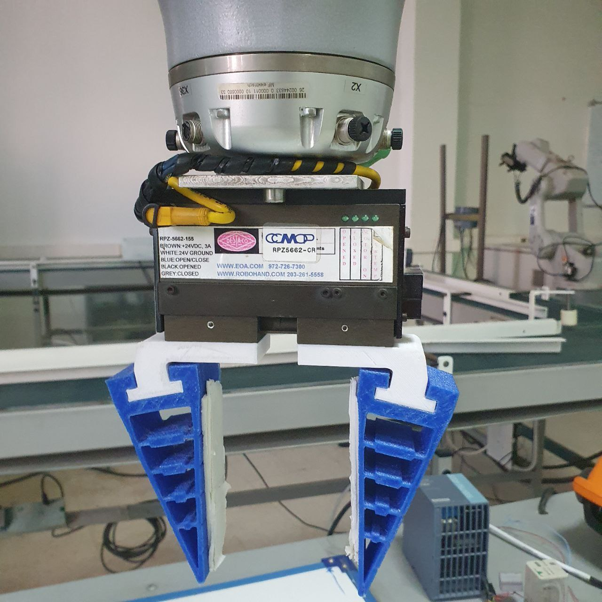

# ESP32-Industrial-Gripper-Controller

**Developed during my internship at CDTA (Centre de Développement des Technologies Avancées).**

This repository contains the hardware design and firmware for a custom control board designed to operate a 24V industrial robotic arm gripper. The system uses an **ESP32-C3** to host a local web server, allowing users to open and close the gripper remotely via a web browser.

## ⚙️ How It Works (Software & Logic)
This is **Version 1.0** of the controller, which operates using **Standard HTTP GET Requests**. 

1. **The Interface:** The user accesses a simple web page hosted on the microcontroller (ESP32).
2. **The Request:** Clicking "Open" or "Close" sends a standard HTTP GET request (e.g., `http://<IP_ADDRESS>/gripper?state=open`).
3. **The Logic:** The microcontroller parses the URL, triggers a full page reload to update the UI, and toggles the specific GPIO pin.
4. **The Actuation:** The GPIO pin drives the onboard control circuit (Relay or MOSFET), which safely switches the 24V power required to physically move the gripper.

---
*(Note: Future versions of this project will migrate to WebSockets for real-time, reload-free UI updates.)*

---

## 🛠️ Hardware Configurations

During the development of this board, I designed two distinct hardware configurations to drive the 24V industrial coil/motor of the gripper. Depending on the application, you can populate the PCB using either a **Relay** or a **MOSFET**.

### Configuration 1: Relay-Based Switching
This configuration uses a standard mechanical relay to switch the 24V line. It acts as an electrically operated physical switch.

| Pros ✅ | Cons ❌ |
|---|---|
| **Robustness:** Highly tolerant to temporary voltage spikes and overloads. | **Mechanical Wear:** Moving metal contacts have a finite lifespan and will eventually wear out. |
| **Isolation:** Complete physical separation between the 24V industrial side and the 3.3V ESP32 logic side. | **Speed:** Relays are relatively slow to switch (milliseconds) and cannot be used for PWM. |
| **Feedback:** Provides an audible "click", which is helpful for debugging in noisy environments. | **Arcing:** Inductive loads (like a gripper coil) can cause arcing across the contacts when opening. |

### Configuration 2: MOSFET-Based Switching
This configuration uses an N-Channel MOSFET as a solid-state switch to control the ground path of the 24V gripper.

| Pros ✅ | Cons ❌ |
|---|---|
| **Infinite Lifespan:** No moving parts means it won't suffer from mechanical wear and tear. | **Heat:** Depending on the current draw, the MOSFET may require a heatsink to dissipate heat. |
| **Silent Operation:** Switches completely silently without any clicking noises. | **Sensitivity:** More vulnerable to Electrostatic Discharge (ESD) and massive voltage spikes if not properly protected. |
| **Speed:** Extremely fast switching times, allowing for potential upgrades like PWM control for variable grip strength. | **Driving Logic:** Requires proper gate-driving circuitry since the ESP32 only outputs 3.3V. |

---

## 🚀 Getting Started

1. Open the code in the `Firmware/` folder using the Arduino IDE.
2. Install the required `DIYables_ESP32_WebServer` library.
3. Update the `WIFI_SSID` and `WIFI_PASSWORD` with your network credentials.
4. Flash the code to your ESP32-C3.
5. Open the Serial Monitor (9600 baud) to find the assigned IP address.
6. Type the IP address into your phone or computer browser to control the arm!
   
Future Roadmap (Version 2.0)
* **WebSocket Integration:** Upgrade the communication protocol from standard HTTP GET requests to WebSockets. This will eliminate the need for full page reloads, providing real-time, bi-directional, and seamless control with zero latency.
  
## 📸 Media
**The Gripper:**
* 
* **Custom PCB:**
* 
