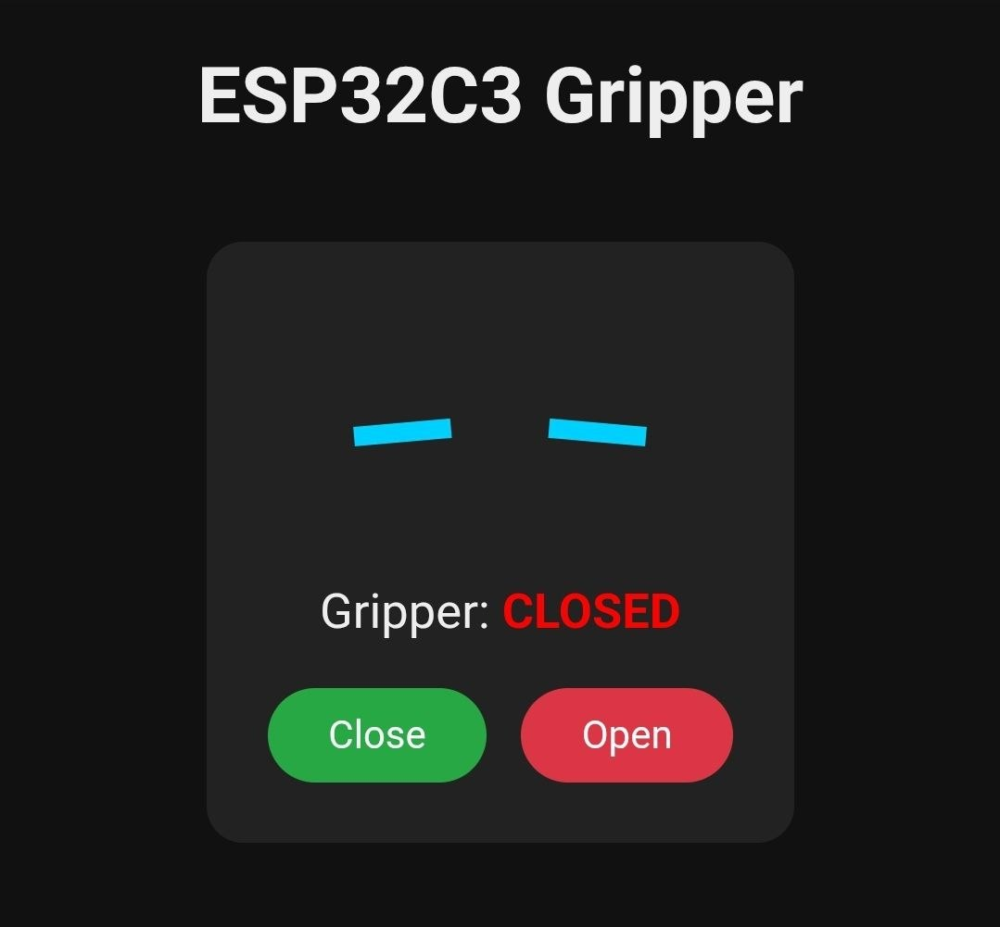
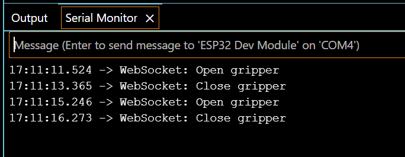

### 🖥️ V1 Web Interface (HTTP GET)
This is the simple web dashboard hosted on the ESP32 for Version 1. Clicking these buttons triggers the HTTP GET requests to open or close the 24V KUKA gripper.

