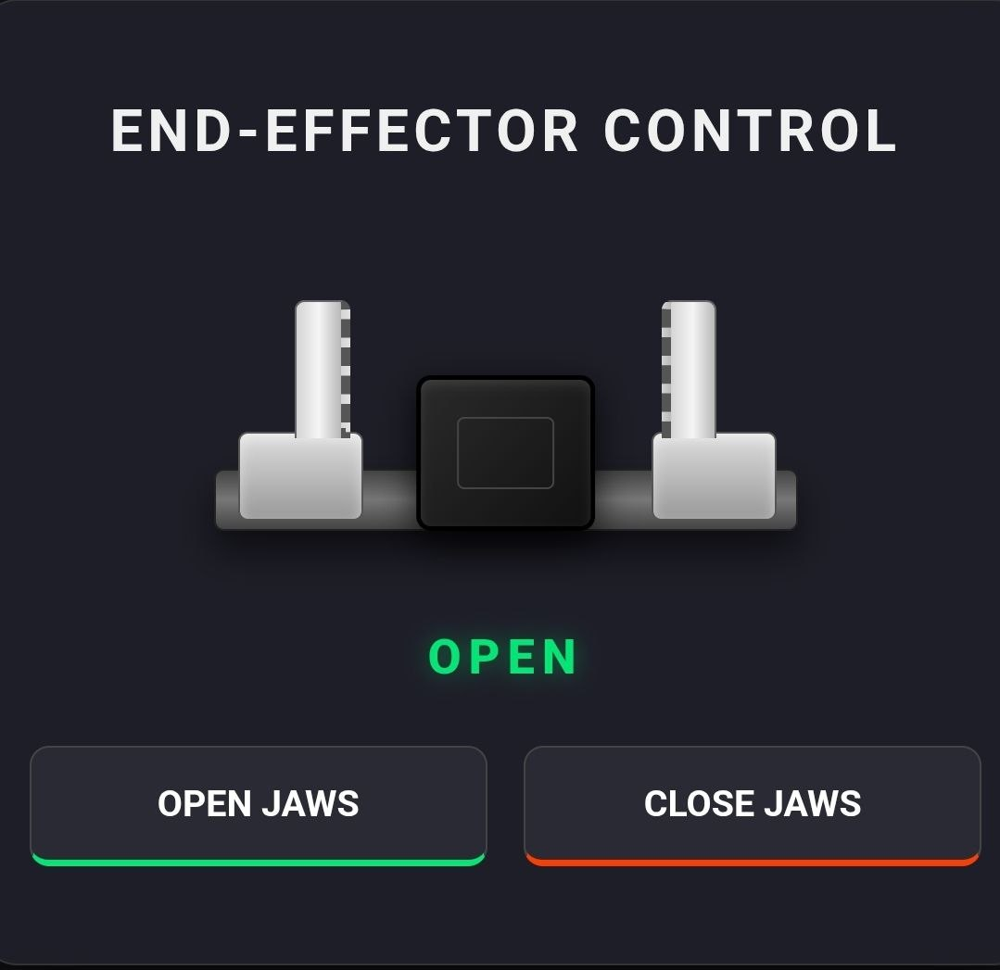

### ⚡ V2: WebSocket Integration (Real-Time Control)
In Version 2, the communication protocol was upgraded from standard HTTP to WebSockets for instant, real-time control.

#### 🖥️ V2 Web Interface

